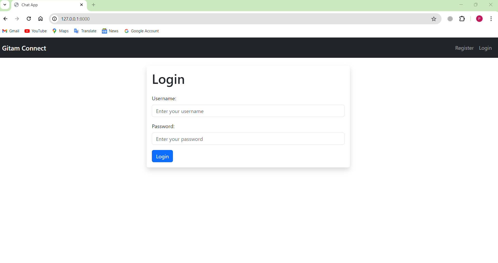
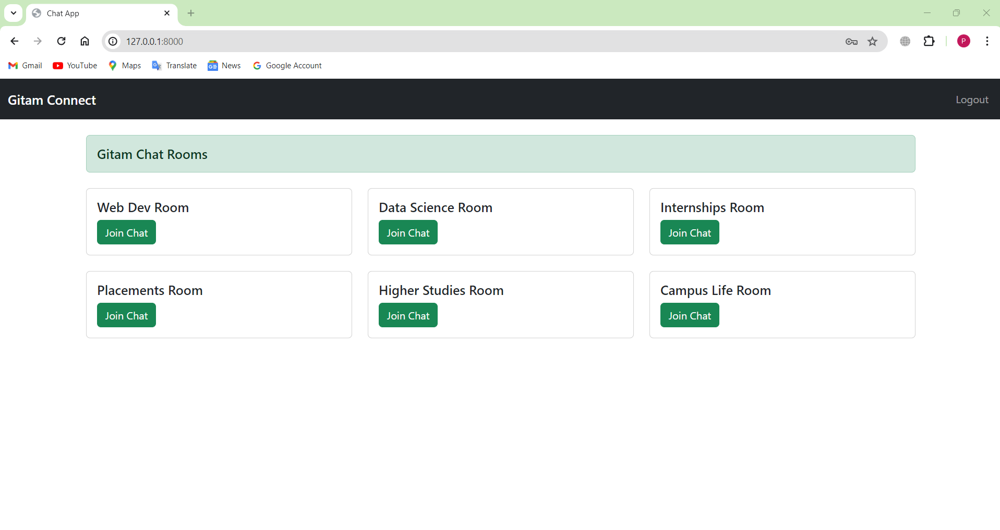
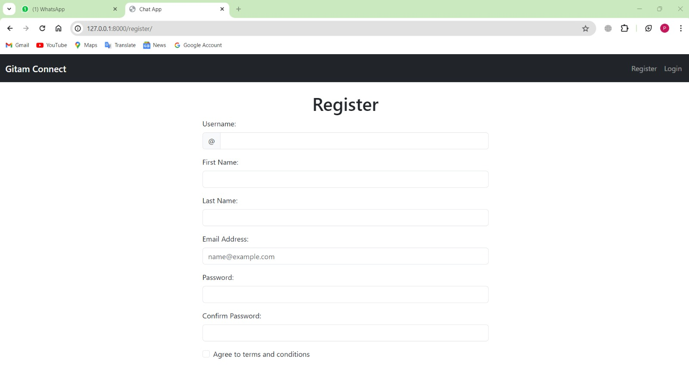

Web App : Gitam-connect

 Overview

This web application allows students to connect and chat with alumni in chat rooms based on specific technical domains. Students can browse available domains, view the list of alumni associated with each domain, and initiate chats after authenticating their accounts.
 
Features

1. Domain-Based Chat Rooms: Organized chat rooms based on technical domains (e.g., Software Development, Data Science, Cybersecurity).
2. Alumni Directory: A searchable list of alumni for each domain.
3. Authentication: Secure login and authentication process for students and alumni.
4. Chat Interface: Real-time messaging system for one-on-one conversations.
5. Profile Viewing: Ability for students to view alumni profiles before initiating a chat.

User Roles

Students
●	Browse and search for technical domains.
●	View alumni profiles associated with specific domains.
●	Initiate chat requests with alumni after authentication.

 Alumni
●	Register and update their profiles.
●	Choose and list technical domains they are proficient in.
●	Accept or decline chat requests from students.

Authentication

Both students and alumni must authenticate themselves before using the chat functionality. Authentication ensures secure access and the integrity of conversations. The authentication process involves:
●	Sign-Up : Students and alumni sign up using their email addresses and create a password.
●	Login :  Users log in with their credentials.

Chat Interface

Once authenticated, students can initiate chat requests by clicking the chat button next to an alumnus's name. The chat interface supports:

●	Real-time messaging
●	Notification of new messages
●	History of previous chats with each alumnus

Profile Viewing

Students can view detailed profiles of alumni before initiating chats. 
●	Professional background
●	Current job title and company
●	Educational history
●	Areas of expertise
Technical Details
Front-End
●	Framework: React.js
●	Styling: CSS3, Bootstrap
●	HTML
Back-End
●	Framework: Node.js with Express.js
●	Database: MongoDB
●	Authentication: JWT (JSON Web Tokens) for secure authentication
This web application provides a robust platform for students to connect with alumni, facilitating knowledge sharing and professional networking within specific technical domains. The secure authentication, intuitive chat interface, and detailed alumni profiles ensure a seamless and productive user experience.

We welcome the contribution to Gitam-Connect! Any ideas for new features , bug fixing is always appreciated. There is always room for improvement and active contribution can help us.
Feel free to open an issue or submit a pull request.
